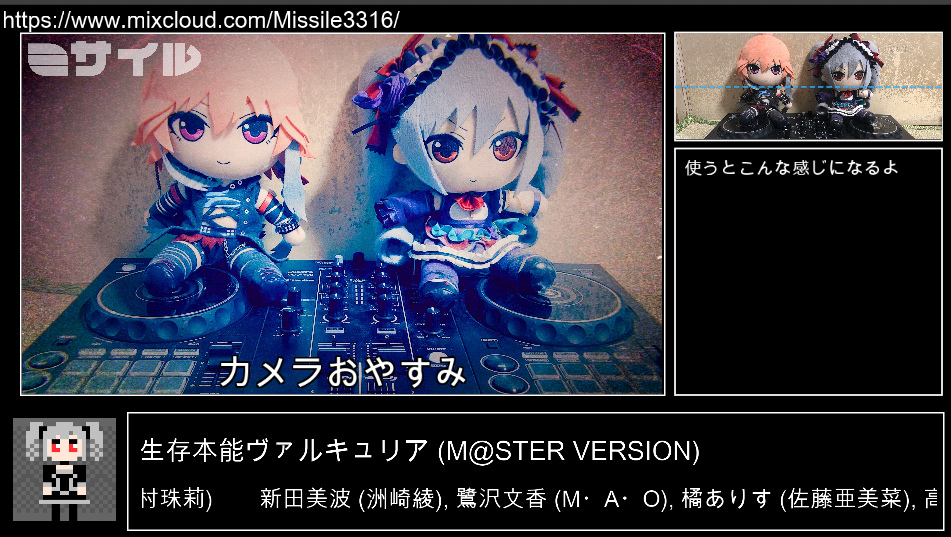

# obs-kuvo-python

obs-websocketとPythonを使って、KUVO経由でrekordboxで流している曲の情報を表示するやつ

## 動作確認済み
Mac OS X Catalina, Windows 10

# 目次
1. [OBSの準備](#obs_setting)
1. [使い方](#how2use)
1. [リポジトリをクローンして動かす方法](#repository)
1. [FAQ](#faq)
1. [連絡先](#contact)
1. [姉妹作](#sister_works)
1. [自分でビルドしたい方へ](#how2build)

# OBSの準備
1. OBSに [obs-websocket](https://github.com/Palakis/obs-websocket/) をインストール
1. OBS起動
1. 「title」「artist」「standby」のテキストソースを作る
    1. 「title」「artist」はそれぞれ曲名とアーティスト名の表示欄になる
    1. 「standby」は初期化時の準備状態を表すテキスト。お好みで「準備中」とか書いといて
1. 「title」「artist」に「scroll」という名前でスクロールのフィルターを作る
1. 上記２つを「music_info」でグループ化
1. 本ツール同梱のconfig.iniの\[sources_config]の欄を編集。スクロール周りの設定などを行います
1. OBSメニューから「ツール -> Websocket Server Settings」でパスワード等を設定
1. 本ツール同梱のconfig.iniの\[client]の欄を編集

# 使い方

1. [chromedriver](http://chromedriver.chromium.org/downloads) を別途ダウンロード
1. 同梱のconfig.iniの\[selenium]の欄を編集、ダウンロードしたドライバのパス等を記述
1. OBSを起動、Websocketサーバを有効にする
1. obs-kuvo-pythonを起動
1. rekordboxにて、KUVOのLive PlaylistをSTARTし、何か曲を流す
1. https://kuvo.com/mykuvo/djmix/playlist に新しいプレイリストができるので開く
1. URLに番号が載ってるので控える
1. テキストボックスにKUVOのプレイリスト番号を入力し、「接続」を押す
- 「初期化」ボタン: OBSで作った「standby」を表示、「music_info」を非表示。このとき「title」「artist」の内容が初期化される
- 「準備OK」ボタン: 「standby」を非表示、「music_info」を表示
- 「リロード」ボタン: KUVOのページを再読み込みして、曲情報を更新
- 「隠す」ボタン: 「???」と表示する。隠したいときなどに。ご活用ください

何かあったらlogの中身を私に報告してください。Macの場合: `obs-kuvo-python.app/Contents/Resources/log`

# リポジトリをクローンして動かす方法
## 環境構築
1. Python 3系をインストール(動作確認バージョン: 3.7.5)
1. `$ pip install -r requirements.txt`
1. [chromedriver](http://chromedriver.chromium.org/downloads) をダウンロード
1. このリポジトリをgit clone、またはreleasesからソースをダウンロード
1. リポジトリ同梱のconfig.iniの\[selenium]を設定

## 使い方(GUIで動かす場合)
1. `$ cd obs-kubo-python`
1. `$ python main_gui.py`

## 使い方(CUIで動かす場合)
こちらに関しては厳密な動作確認をしていません。ご了承ください。
1. `$ cd obs-kubo-python`
1. `$ python main.py`
1. `$ 初期化する？(y or n):` -> 「y」
    1. なんか落ちたとかでDJしてる途中から起動した場合は「n」、8へ
1. rekordboxにて、KUVOのLive PlaylistをSTARTし、何か曲を流す
1. https://kuvo.com/mykuvo/djmix/playlist に新しいプレイリストができるので開く
1. URLに番号が載ってるので控える
1. `$ ENTERで準備状態を解除します。曲を流してください(KUVOのオンを忘れずに):` -> 何も入力せずにENTER
1. `$ KUVOのプレイリストの番号を入力:` -> さっき控えた番号を入力

### `ENTERでリロード, hで伏せる, zで終了:` が表示されてから
- 何も入力せずにENTERでリロード
- 「h」で「???」と表示する。隠したいときなどに。ご活用ください
- 「z」で終了、OBSとの接続を切ります

# FAQ
- Q. SessionNotCreatedExceptionって出た
    - A. 多分使ってるChromeとChromeDriverのバージョンが合ってない。
- Q. Windowsでよくわからん表示が出る
    - A. CUI利用の場合でも `$ ENTERでリロード, hで伏せる, zで終了:` は出てるはずだからとりあえず動く。Windowsのことはようわからんへん
- Q. OBSでソースのロックを切り替えたら動作がおかしくなった、Invalid event SceneItemLockChangedって出た
    - A. 最近obs-websocketに更新が入って、obs-websocket-pyがまだ対応していないっぽいので触らないように
- Q. 自動で曲情報を更新しないの？
    - A. それで想定外の表示とかされるよりかは…という理由で手動更新。隠す機能とかは手動の方が都合がいいだろうし。
    

# 連絡先
[Twitter](https://twitter.com/msir3316)

# 姉妹作
[obs-kuvo(suzu2464氏制作)](https://github.com/suzu2469/obs-kuvo)

# 自分でビルドしたい方へ
ビルドするツールはいろいろありますが、私はこれを使いました： py2app, pyinstaller
